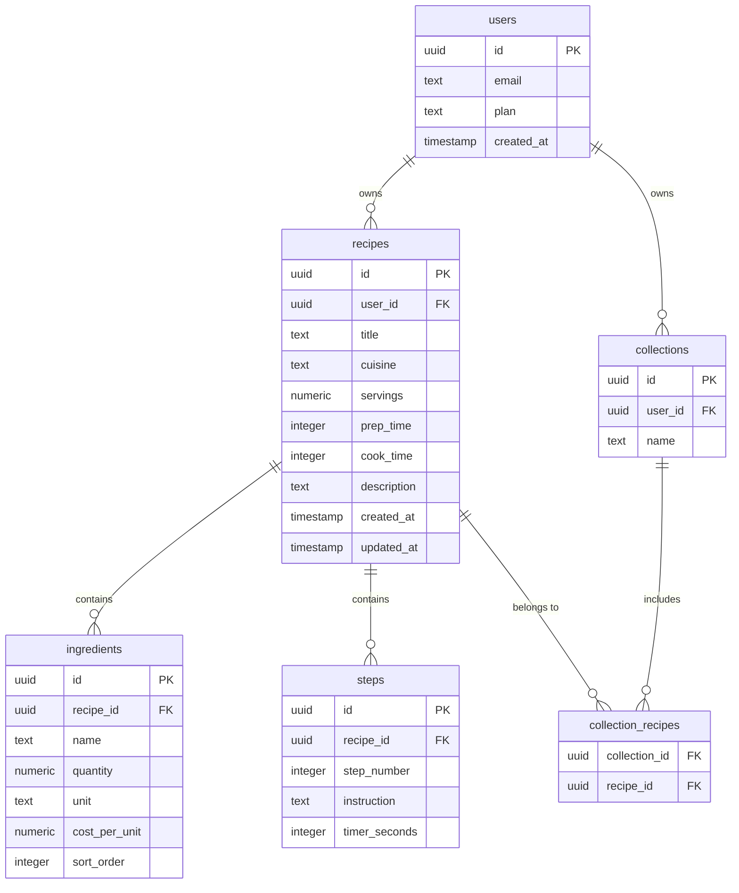

# ChefVault — Product Specification

> **Professional recipe management for chefs, restaurants, and serious kitchens.**

## 1. Overview

ChefVault is a mobile-first recipe management application built for professional kitchen environments. It provides structured recipe storage, automatic scaling, food cost tracking, collection-based organization, and prep list generation.

ChefVault is **not** a consumer cooking guide. It is a **kitchen productivity tool** designed around speed, clarity, structured data, and minimal interaction friction.

### Core Capabilities

| Capability             | Description                                              |
| ---------------------- | -------------------------------------------------------- |
| Recipe Library         | Centralized, searchable recipe database                  |
| Recipe Scaling         | Proportional ingredient scaling by serving count         |
| Food Costing           | Per-ingredient cost tracking with per-serving roll-ups   |
| Collections            | Folder-based recipe organization with multi-membership   |
| Prep Lists             | Cross-recipe ingredient aggregation for service planning |

---

## 2. Target Users

### Primary

- Professional chefs (line, sous, executive)
- Restaurant kitchens (front-of-house prep teams)
- Private chefs
- Culinary students

### Secondary

- Advanced home cooks
- Food entrepreneurs & startups
- Caterers & event planners

---

## 3. Value Proposition

| Pain Point                                       | ChefVault Solution                          |
| ------------------------------------------------ | ------------------------------------------- |
| Recipes scattered across notebooks, docs, photos | Centralized, structured recipe database     |
| Manual recipe scaling is error-prone             | Automatic proportional ingredient scaling   |
| No visibility into food cost per dish            | Built-in cost-per-unit and cost-per-serving |
| Service prep requires manual aggregation         | Automated ingredient aggregation & prep lists |
| No organization system for recipes               | Collections, tags, and search               |

---

## 4. Platforms & Technology

### Target Platforms

- iOS
- Android

### Stack

| Layer          | Technology                |
| -------------- | ------------------------- |
| Framework      | Expo (React Native)       |
| Backend        | Supabase                  |
| Database       | PostgreSQL (via Supabase) |
| Authentication | Supabase Auth             |
| File Storage   | Supabase Storage          |

> Full stack details: @File(./tech-context.md)  
> Architecture patterns: @File(./system-architecture.md)

---

## 5. Core Features (MVP)

### 5.1 Recipe Library

The primary screen. Displays all user recipes in a scannable, searchable list.

**Functionality:**

- Full-text search across recipe titles and tags
- Filter by tag, cuisine, or collection
- Recipe cards with summary metadata
- Quick-access edit action

**Recipe Card Fields:**

| Field            | Type      | Notes                       |
| ---------------- | --------- | --------------------------- |
| Title            | text      | Primary identifier          |
| Cuisine Tag      | text      | e.g., French, Japanese      |
| Servings         | numeric   | Base serving count          |
| Prep Time        | integer   | Minutes                     |
| Last Edited Date | timestamp | Auto-updated on save        |

---

### 5.2 Recipe Detail

Displays the full recipe in a read-optimized layout.

**Sections:**

#### Recipe Info

| Field       | Type    |
| ----------- | ------- |
| Title       | text    |
| Cuisine     | text    |
| Servings    | numeric |
| Prep Time   | integer |
| Cook Time   | integer |
| Description | text    |

#### Ingredients

Structured ingredient list. Quantities update automatically when the serving count changes.

| Quantity | Unit | Ingredient |
| -------: | ---- | ---------- |
| 200      | g    | Salmon     |
| 10       | ml   | Olive Oil  |
| 3        | g    | Salt       |

#### Method

Numbered procedural steps.

```
1. Cure salmon with salt for 20 minutes
2. Rinse and pat dry
3. Cook gently in olive oil
```

---

### 5.3 Recipe Scaling

Dynamic, proportional ingredient scaling based on target serving count.

**Example — Scaling from 4 → 10 servings:**

| Ingredient | Base (4 srv) | Scaled (10 srv) |
| ---------- | -----------: | --------------: |
| Butter     | 200 g        | 500 g           |
| Cream      | 300 ml       | 750 ml          |

**Scaling Rules:**

- All ingredient quantities scale proportionally to the serving ratio
- Unit conversions are supported (e.g., ml → L when threshold crossed)
- Decimal precision is handled automatically (rounding to practical kitchen values)

---

### 5.4 Create / Edit Recipe

Full recipe authoring and modification workflow.

#### Recipe Info Fields

| Field       | Required | Type    | Notes                    |
| ----------- | -------- | ------- | ------------------------ |
| Title       | yes      | text    |                          |
| Cuisine     | no       | text    | Free-text or from presets |
| Servings    | yes      | numeric | Base serving count       |
| Prep Time   | no       | integer | Minutes                  |
| Cook Time   | no       | integer | Minutes                  |
| Description | no       | text    | Free-form notes          |

#### Ingredients Editor

Each ingredient is a structured row:

| Field          | Required | Notes                    |
| -------------- | -------- | ------------------------ |
| Quantity       | yes      | Numeric value            |
| Unit           | yes      | g, kg, ml, L, pcs, etc. |
| Ingredient     | yes      | Name / label             |
| Notes          | no       | e.g., "finely diced"     |
| Cost per Unit  | no       | Pro feature — see §5.7   |

**Editor Actions:** Add, delete, drag-to-reorder.

#### Steps Editor

Each step is a numbered instruction:

| Field       | Required | Notes                        |
| ----------- | -------- | ---------------------------- |
| Step Number | auto     | Sequential, auto-maintained  |
| Instruction | yes      | Free-text instruction        |
| Timer       | no       | Optional countdown in seconds |

**Editor Actions:** Add, delete, reorder.

---

### 5.5 Collections

Folder-based recipe organization. Each recipe can belong to **multiple** collections.

**Example Collections:**

- Dinner Service
- Desserts
- R&D
- Sauces
- Staff Meals

---

### 5.6 Prep Lists

Prep lists aggregate ingredients across a selection of recipes into a single, consolidated shopping/prep view.

**Example — Selecting 3 recipes:**

> Salmon Confit · Lemon Tart · Caesar Salad

**Generated Prep List:**

| Ingredient | Aggregated Amount |
| ---------- | ----------------: |
| Salmon     | 3.4 kg            |
| Olive Oil  | 1.2 L             |
| Garlic     | 220 g             |

**Functionality:**

- Automatic ingredient aggregation with unit normalization
- Grouped display (by category or alphabetical)
- Printable / exportable output

---

### 5.7 Recipe Costing *(Pro Feature)*

Per-ingredient cost tracking with automatic roll-up to recipe and per-serving totals.

**Ingredient Cost Entry:**

| Ingredient | Cost per Unit |
| ---------- | ------------: |
| Salmon     | $22.00 / kg   |
| Olive Oil  | $18.00 / L    |

**Recipe Cost Output:**

| Metric            |  Value |
| ----------------- | -----: |
| Total Recipe Cost | $12.60 |
| Cost per Serving  |  $3.15 |

---

## 6. Monetization

Freemium subscription model.

### Free Plan

| Feature          | Limit / Detail       |
| ---------------- | -------------------- |
| Recipes          | Up to 50             |
| Collections      | Unlimited            |
| Recipe Scaling   | Full                 |
| Search           | Basic (title, tags)  |

### Pro Plan *(Subscription)*

| Feature          | Detail                          |
| ---------------- | ------------------------------- |
| Recipes          | Unlimited                       |
| Ingredient Costing | Full cost tracking & roll-ups |
| Prep Lists       | Generation & export             |
| PDF Export       | Recipe & prep list export       |
| Search           | Advanced (full-text, filters)   |

---

## 7. Database Schema

> Authoritative schema reference. See @File(./system-architecture.md) for relationships and indexing strategy.

### `users`

| Field        | Type      | Constraints          |
| ------------ | --------- | -------------------- |
| `id`         | uuid      | PK                   |
| `email`      | text      | unique, not null     |
| `plan`       | text      | default `'free'`     |
| `created_at` | timestamp | default `now()`      |

### `recipes`

| Field         | Type      | Constraints               |
| ------------- | --------- | ------------------------- |
| `id`          | uuid      | PK                        |
| `user_id`     | uuid      | FK → `users.id`, not null |
| `title`       | text      | not null                  |
| `cuisine`     | text      |                           |
| `servings`    | numeric   | not null, default `1`     |
| `prep_time`   | integer   | minutes                   |
| `cook_time`   | integer   | minutes                   |
| `description` | text      |                           |
| `created_at`  | timestamp | default `now()`           |
| `updated_at`  | timestamp | default `now()`           |

### `ingredients`

| Field           | Type    | Constraints                |
| --------------- | ------- | -------------------------- |
| `id`            | uuid    | PK                         |
| `recipe_id`     | uuid    | FK → `recipes.id`, not null |
| `name`          | text    | not null                   |
| `quantity`      | numeric | not null                   |
| `unit`          | text    | not null                   |
| `cost_per_unit` | numeric | nullable (Pro)             |
| `sort_order`    | integer | for drag-to-reorder        |

### `steps`

| Field           | Type    | Constraints                |
| --------------- | ------- | -------------------------- |
| `id`            | uuid    | PK                         |
| `recipe_id`     | uuid    | FK → `recipes.id`, not null |
| `step_number`   | integer | not null                   |
| `instruction`   | text    | not null                   |
| `timer_seconds` | integer | nullable                   |

### `collections`

| Field      | Type | Constraints               |
| ---------- | ---- | ------------------------- |
| `id`       | uuid | PK                        |
| `user_id`  | uuid | FK → `users.id`, not null |
| `name`     | text | not null                  |

### `collection_recipes` *(join table)*

| Field           | Type | Constraints                    |
| --------------- | ---- | ------------------------------ |
| `collection_id` | uuid | FK → `collections.id`, not null |
| `recipe_id`     | uuid | FK → `recipes.id`, not null    |
|                 |      | PK (`collection_id`, `recipe_id`) |

> **Note:** The `collection_recipes` join table is required to support many-to-many membership (a recipe can belong to multiple collections).

### Entity Relationship Diagram



---

## 8. Navigation Structure

Bottom tab navigation (5 tabs):

```
┌─────────┬─────────────┬────────┬────────────┬──────────┐
│ Recipes │ Collections │ Create │ Prep Lists │ Settings │
└─────────┴─────────────┴────────┴────────────┴──────────┘
```

| Tab         | Destination                          |
| ----------- | ------------------------------------ |
| Recipes     | Recipe Library (search, filter, list) |
| Collections | Collection list → recipe sublist     |
| Create      | New recipe form                      |
| Prep Lists  | Prep list builder & history          |
| Settings    | Account, plan, preferences           |

---

## 9. Design Principles

| Principle              | Rationale                                                    |
| ---------------------- | ------------------------------------------------------------ |
| **Speed**              | Kitchen environments demand instant access — no loading walls |
| **Clarity**            | Data-dense screens must remain scannable at a glance          |
| **Structured Data**    | Recipes are structured documents, not free-form text          |
| **Minimal Taps**       | Reduce interaction cost — every tap must earn its place        |
| **Fast Editing**       | Inline editing over modal workflows wherever possible          |
| **Professional UX**    | Tool aesthetic, not tutorial aesthetic                         |

> Full design system: @File(./design-principles.md)

---

## 10. Success Metrics

| Metric                       | Target (MVP)       | Measurement           |
| ---------------------------- | ------------------ | --------------------- |
| Recipes created per user     | ≥ 10 in first week | Analytics             |
| Weekly active users (WAU)    | Baseline + growth  | Analytics             |
| Prep lists generated / week  | ≥ 1 per active user | Analytics            |
| Free → Pro conversion rate   | ≥ 5%              | Subscription tracking |
| 30-day retention             | ≥ 40%             | Cohort analysis       |

---

## 11. Future Roadmap

Items **not** included in MVP, prioritized by estimated user impact:

| Priority | Feature                        | Notes                                  |
| -------- | ------------------------------ | -------------------------------------- |
| High     | Menu Builder                   | Compose menus from recipe collections  |
| High     | Ingredient Inventory Tracking  | Track stock levels against usage       |
| Medium   | AI Recipe Parsing              | Import recipes from text/photos        |
| Medium   | Recipe Version History         | Track changes over time                |
| Medium   | Team Collaboration             | Shared kitchen workspaces              |
| Low      | Supplier Integrations          | Link ingredients to supplier catalogs  |
| Low      | Nutrition Analysis             | Macro/micro breakdown per recipe       |

---

## Appendix: Glossary

| Term           | Definition                                                        |
| -------------- | ----------------------------------------------------------------- |
| Recipe         | A structured document with metadata, ingredients, and method steps |
| Collection     | A user-defined grouping of recipes (many-to-many)                  |
| Prep List      | An aggregated ingredient list derived from selected recipes        |
| Scaling        | Proportional adjustment of ingredient quantities by serving ratio  |
| Costing        | Per-ingredient unit cost tracking with recipe-level roll-up        |
| Base Servings  | The original serving count a recipe was authored for               |

---

*Document version: 1.0.0 · MVP specification · Last updated: 2026-03-05*
